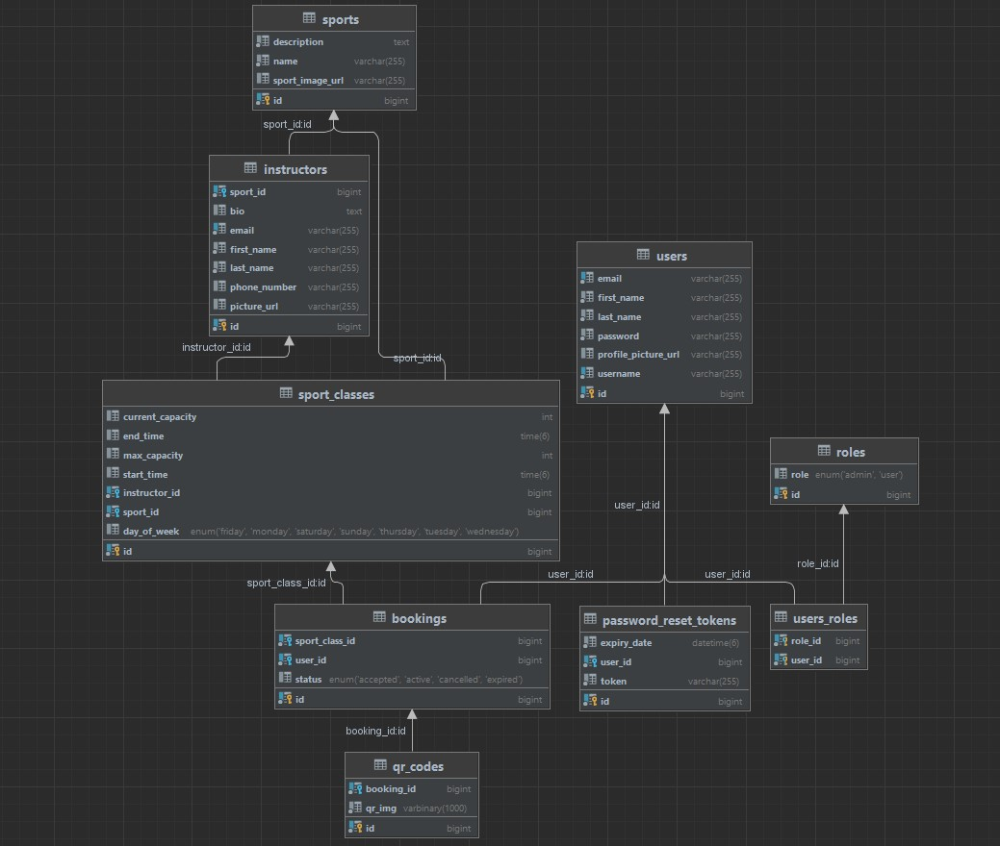

# Sports Center
Welcome to the Sports Center application, a Spring Boot MVC web application designed for seamless sport class bookings.  
This project allows users to register, book sport classes, manage their bookings, and interact with various features to enhance their experience.

## ER Diagram:

## Tech Stack
Java  
Spring Boot MVC  
Spring Security  
OAuth 2.0  
Spring Data JPA  
Hibernate  
MySQL  
JUnit  
Maven  
Lombok  
Mapstruct  
Cloudinary  
Bootstrap  
Thymeleaf  
HTML CSS JS  

## Features 
### User Features
**User Registration:** Users can register for an account, providing necessary details.  
**Sport Class Schedule:** View a table displaying the schedule of available sport classes.  
**Booking:** Users can book a spot in a sport class from the available schedule.  
**Booking Management:** Users can see their booked classes, cancel bookings, and access generated QR Codes for hall entrance.  
**Instructor Selection:** View a list of instructors, choose based on preferences.  
**Profile Management:** Users can view and update their profile picture and other details.  
**Password Reset:** Option to reset passwords securely.  
**Google OAuth Login:** Users can log in using their Google accounts.  
**Email Notifications:** Receive emails for new registrations and password resets.  

### Admin Features
**Booking Management:** Admins can Accept or Cancel user bookings, searching for users by username.  
**User Management:** Edit or Delete users.  
**User Role Management:** Control and change user roles.  
**Instructor Management:** Add new instructors to the system.  
**Sport Class Management:** Add new Sport Classes considering current schedule.  
**Sport Management:** Add or Delete sports.  

### Other features
#### Scheduled Tasks
The system executes the following tasks at specified intervals:  

Everyday at midnight: 
Sets the status of unused bookings to expired and delete their QR codes. 
Reset the capacity of passed classes for the next week bookings. 

Every Sunday: 
Delete all non-active bookings and their QR codes to reset them for the next week. 
Delete expired password reset tokens for the past week. 

#### Interceptors
Having two interceptors: 
1 restricting access to the app during Maintenance window in Sunday between 23:00 PM and 00:00 AM 
1 to collect information for all requests sent to the system. 

**Implements error handling and data validation both client and server-side.**  

**Has a REST Controller that is called upon by the JavaScript fetch API to asynchronously load the user's bookings to their profile.** 

## Testing
Achieved 60% code coverage, having both Integration and Unit tests.  

## Setting Up the Environment
Follow these steps to set up environment variables in the application.yml file for local development: 

**Cloudinary Account:**
Set cloudinary.cloud-name, cloudinary.api-key, and cloudinary.api-secret with your Cloudinary account details. 

**Database Configuration:**
Set spring.datasource.url, spring.datasource.username, and spring.datasource.password for your database. 

**Email SMTP Server:**
Set spring.mail.host, spring.mail.port, spring.mail.username, and spring.mail.password for your email SMTP server. 

## Running the Application Locally
Clone the repository: git clone https://github.com/antongoranov/SportsCenter.git  
Navigate to the project directory: cd SportsCenter  
Open src/main/resources/application.yml and set the required environment variables.  
Build the project: ./mvnw clean install  
Run the application: ./mvnw spring-boot:run  
Visit http://localhost:8080 in your web browser to access the Sports Center application  

#### Feel free to explore, book classes, and manage the system as a user or an admin!

